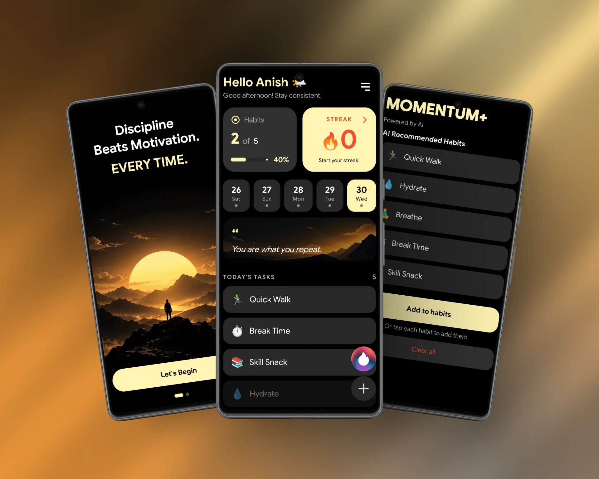
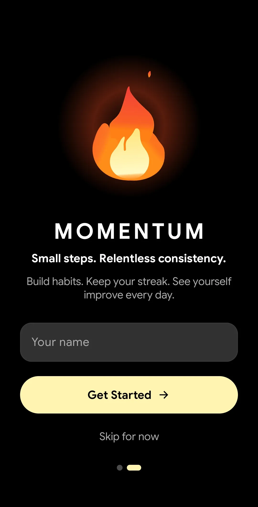
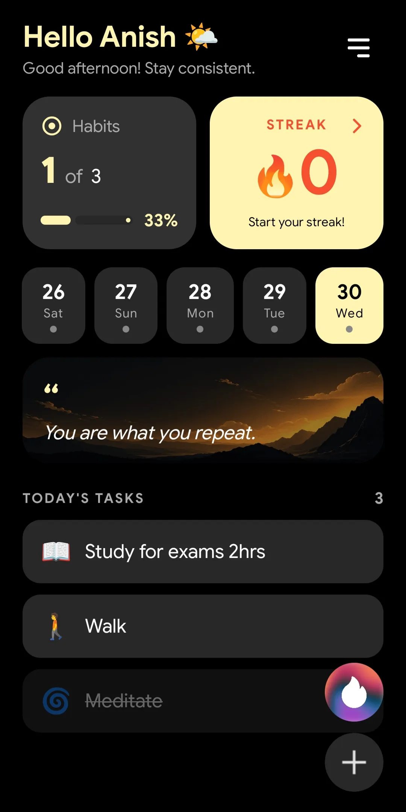
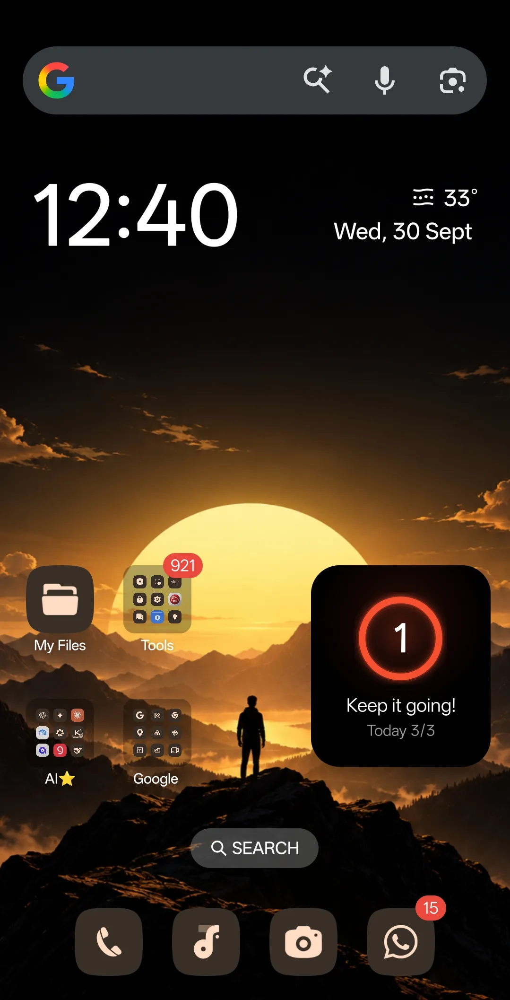
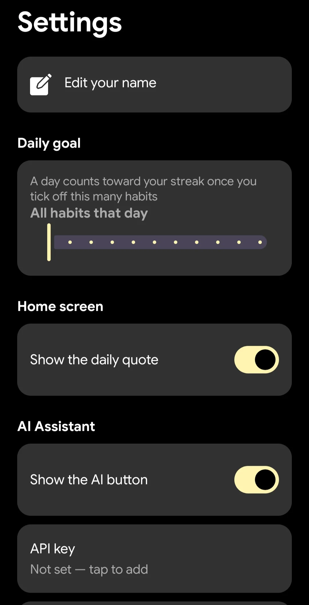
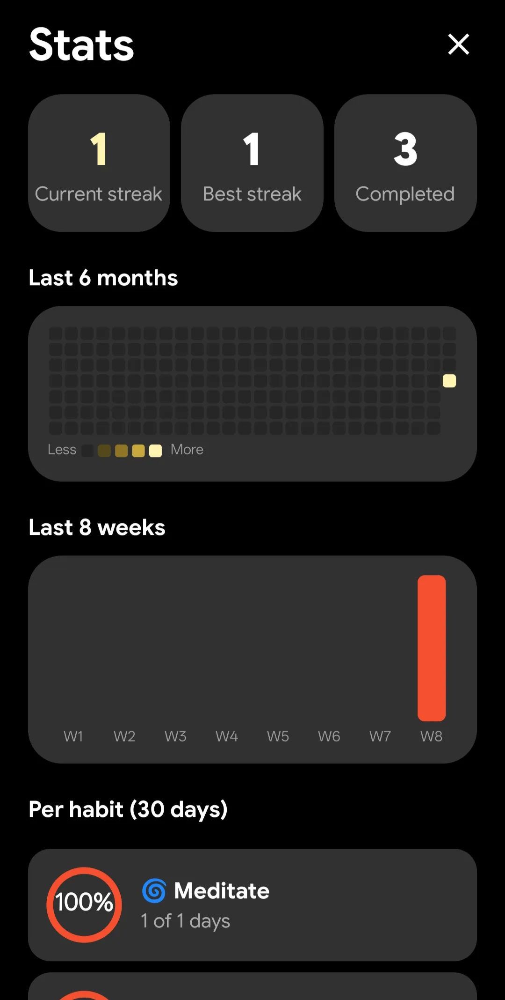
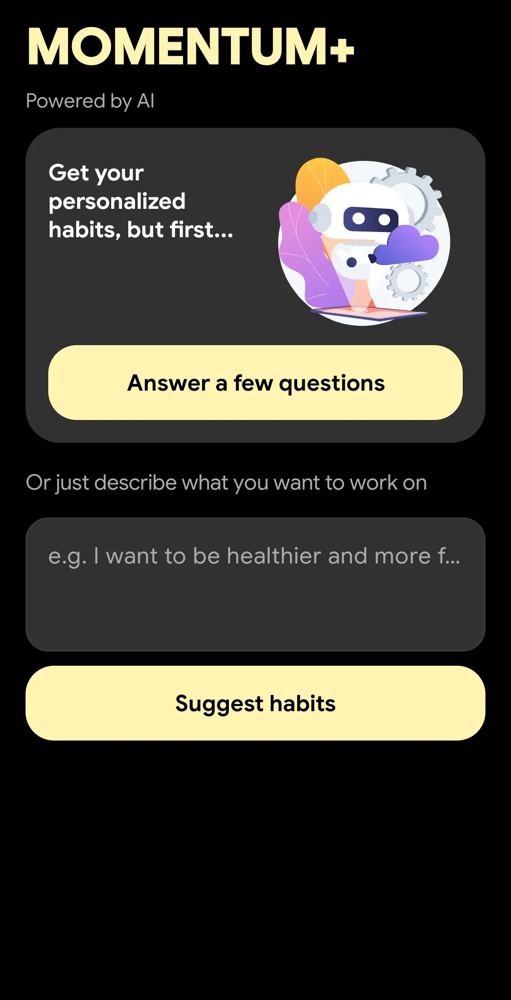
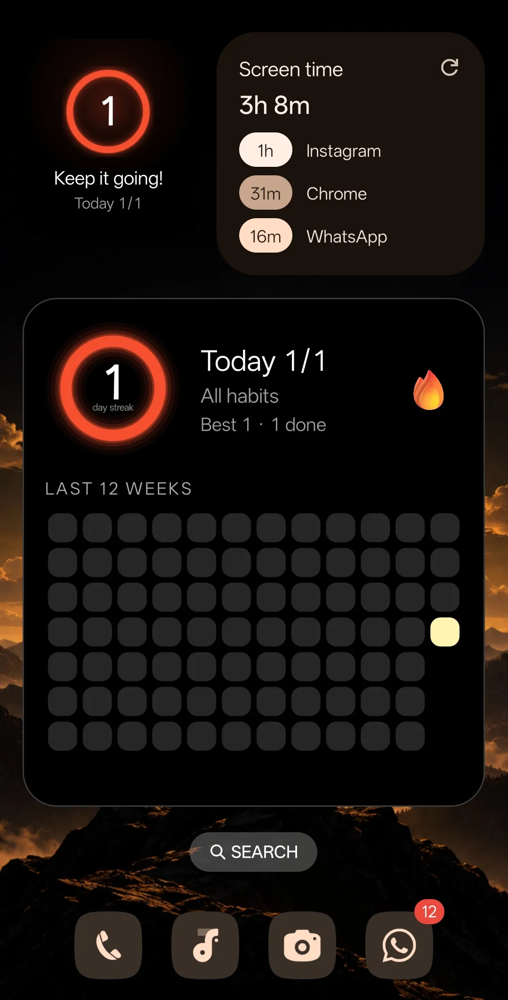
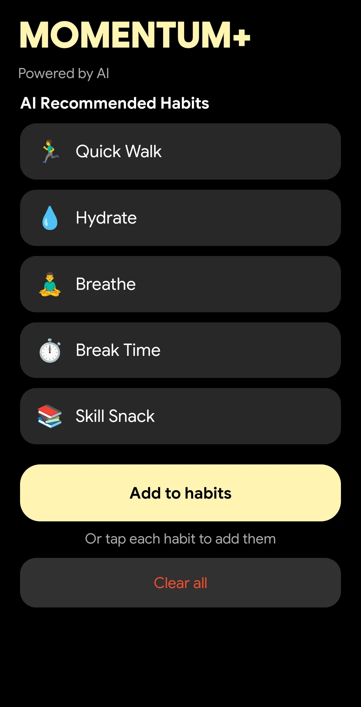

# Momentum 🔥

**A privacy-first habit tracker for Android, 100% offline, zero tracking, no accounts. Build routines, watch your streak grow, and keep every habit on the phone you carry everywhere.**



[](LICENSE)
[](https://kotlinlang.org)
[](https://developer.android.com)
[](https://github.com/Xeven777/MomentumApp#what-is-momentum)
[](https://github.com/Xeven777/MomentumApp)


## What is Momentum?

Momentum is an **open-source Android habit tracker** that runs entirely on your phone. There are no accounts, no cloud sync, no analytics, no ads, and no subscriptions. Every habit, every completion, every streak is stored locally in a Room database, locked behind your device's screen lock.

The AI assistant is the one feature that touches the network, and it is opt-in. You paste your own API key, pick an OpenAI-compatible provider, and the key is encrypted in the Android Keystore. If you never set a key, the app never makes a network call.

---

## Features

| Feature | What it does |
|---|---|
| 📋 **Habit tracking** | Add, edit, and delete habits with an emoji, all stored locally in Room. |
| 🏠 **Home screen** | A Habits card with today's progress bar and percentage, a streak card that opens Stats, a scrollable day strip that expands into a month calendar, and a quote that rotates daily. |
| 👋 **One-time welcome** | A splash with a _Get Started_ button and a name step on first run. After that the app opens straight to your habits, and the name can be changed later in Settings. |
| 🔥 **Smart streaks** | Set a daily goal ("3 habits a day", or _all habits_ by default). A day only counts once you hit the goal, and adding a habit no longer wipes your streak. |
| 📊 **Stats screen** | Current and best streak, a six-month contribution grid, an eight-week trend, per-habit 30-day completion rates, and badge unlocks (3 / 7 / 30 / 100-day streaks plus a "perfect week"). |
| 🗓 **Scheduled habits** | Pick which weekdays a habit applies to. Streaks, reminders, and widgets all respect the schedule. A Mon/Wed/Fri habit never makes a Tuesday look like a miss. |
| 📅 **Month calendar** | Tap the day strip to expand a full month view with a per-day completion ring. Swipe between months, tap to select a day. Collapsed by default so it takes no screen space. |
| 📱 **Home screen widgets** | A progress ring with your streak and today's completion, plus a 12-week GitHub-style contribution grid (large widget), or a compact 2×2 streak ring (mini widget). Tap either to open the app. |
| ⏰ **Reminders** | Per-habit reminder times that re-arm automatically after a reboot, a package update, or a clock/timezone change. |
| 🤖 **AI assistant (optional)** | Bring your own API key and point the app at any OpenAI-compatible provider (OpenRouter, Groq, OpenAI, Gemini, Claude). Suggest habits from a questionnaire, from your own free-text description, or both. |
| 🔒 **Fully offline** | Habits live in a Room database on-device. The only network call is the AI request you trigger yourself. |

---

## Screenshots

<table>
  <tr>
      <td></td>
    <td></td>
    <td></td>
  </tr>
  <tr>
    <td></td>
    <td></td>
    <td></td>
  </tr>
   <tr>
    <td></td>
    <td></td>
    <td></td>
  </tr>
</table>

---

## Why another habit tracker?

There are a lot of habit trackers. Momentum exists because most of them trade your data or your attention. Here is how it compares:

- Habitica: gamification, social feed, and cloud sync. Momentum has none of those.
- Streaks: closed source. Momentum is open source with the streak logic covered by tests.
- Loop / Routine: AI suggestions go to the cloud by default. Momentum's AI is opt-in with your own key.
- Freemium apps: paywalls and subscriptions. Momentum is MIT licensed, free, zero paywalls.

If you want a habit tracker with no cloud, no ads, and no paywalls, this is it.

---

## Getting started

### Requirements

- **JDK 17** or newer. If your system `java` is a JRE without `javac`, the Gradle build auto-provisions a JDK 17 toolchain for you (the `foojay-resolver-convention` plugin in `settings.gradle.kts`), so nothing to install manually.
- **Android SDK**, platform 36. Point the build at it with either the `ANDROID_HOME` (or `ANDROID_SDK_ROOT`) environment variable, or a `local.properties` in the repo root containing `sdk.dir=/path/to/Android/sdk`.

### Quick build

```bash
git clone https://github.com/Xeven777/MomentumApp.git
cd Momentum

./gradlew assembleDebug          # debug APK
./gradlew testDebugUnitTest      # JVM unit tests
./gradlew installDebug           # build + install on a connected device
```

There is nothing to configure. No API keys in the repo, no `google-services.json`, no Firebase project.

---

## Building from source

This is a standard Android Gradle project. From the repo root:

```bash
./gradlew assembleDebug          # produces app/build/outputs/apk/debug/app-debug.apk
./gradlew assembleRelease        # minified + R8-shrunk release APK (unsigned)
```

Release builds use R8 minification and resource shrinking. The release APK is **~2.49 MB** (the per-ABI splits the release workflow ships are ~2.44 MB each), with no Firebase, no Analytics, and no crash-reporting SDKs.

Sizes here are dominated by two things that are easy to overlook, because `resources.arsc` is stored *uncompressed* and therefore costs one APK byte per byte: the resource table and the DEX. The app ships **English only** — `androidResources.localeFilters` drops the ~85 locale configs that AppCompat and Material would otherwise contribute, which is worth roughly 15% of the APK on its own. There is no i18n effort to preserve: every string this app declares is already English.

---

## Testing on a device over USB

1. **Enable developer options** on the phone: Settings → About phone → tap **Build number** seven times.
2. **Enable USB debugging**: Settings → Developer options → **USB debugging**.
3. **Connect the phone** over USB and accept the _Allow USB debugging?_ prompt on the device. Tick **Always allow from this computer** if you want to stop being asked.
4. **Verify the connection**:

   ```bash
   adb devices -l
   ```

   Your device should show up as `device`, not `unauthorized` or `offline`. If it is missing, try a different USB cable/port (some are charge-only) or `adb kill-server && adb devices`.

5. **Install and launch**:

   ```bash
   ./gradlew installDebug
   adb shell am start -n com.anish.momentum/.LauncherActivity
   ```

   Or open the app from the launcher like normal.

6. **Useful while debugging**:

   ```bash
   adb logcat -s StreakWidget StreakMiniWidget AiActivity ApiKeyStore:* MainActivity:*
   adb shell dumpsys activity com.anish.momentum      # is it running / any crash history
   adb shell pm list packages | grep momentum
   ```

7. **Uninstall** when you are done:

   ```bash
   adb uninstall com.anish.momentum
   ```

---

## Tests

```bash
./gradlew testDebugUnitTest        # pure JVM logic, no device needed
./gradlew connectedDebugAndroidTest  # instrumented tests, needs a device
```

The unit tests cover the streak/goal arithmetic, the day-of-week schedule masks, the badge rules, the AI base-URL normalisation, the AI reply parser, and the widget's contribution-grid alignment.

**47 unit tests pass across 6 test classes.**

---

## Configuring the AI assistant

The app ships with no key and no endpoint baked in. Open **Settings → AI Assistant** and set:

| Setting | Notes |
|---|---|
| **API key** | Stored encrypted with a key held in the Android Keystore. Never leaves the device, never in the build. |
| **Base URL** | Any OpenAI-compatible endpoint. Defaults to `https://openrouter.ai/api/v1`. A missing trailing `/` is added for you. |
| **Model** | Whatever your provider calls it, e.g. `qwen/qwen3.8-27b:free` or `google/gemma-4-31b-it:free`. |
| **System prompt** | Editable. Controls the format the model returns. |
| **Temperature** | 0.0 – 2.0. |

**Test connection** calls `GET /models` and tells you how many models the endpoint exposes. This is the quickest way to check the key and base URL before spending a completion. If OpenRouter is your provider, a free key is enough to get started.

---

## Technologies

- **Kotlin 2.0.21**, coroutines, official code style
- **Room 2.6.1** for habits and completions, using KSP annotation processing
- **DataStore** for settings (name, daily goal, AI config)
- **AndroidX Security / Keystore** keeps the API key encrypted at rest
- **Retrofit 2.9 + OkHttp + Gson 2.13** for AI calls only, only on your trigger
- **Material Design 3** with a single-accent dark theme (no dynamic colour), plus adaptive icons
- **Lottie 6.6.7** for the flame animation and loaders
- **R8** with resource shrinking on release builds, plus English-only locale filtering (the single largest size lever)
- **Lint** with a baseline, so fresh issues fail the build

---

## Contributing

Pull requests are welcome. For major changes, open an issue first to discuss what you would like to change.

To get started:

1. Fork, clone, then run `./gradlew testDebugUnitTest`. The suite should pass.
2. Look at the [open issues](https://github.com/Xeven777/MomentumApp/issues) or open your own.
3. Keep PRs small and focused. The streak arithmetic and schedule masks are well-tested, so trust that safety net.

Follow the `.editorconfig`, use `kotlin.code.style=official`, and make sure `./gradlew lint` is clean before you push.

---

## Credits

Built with ❤️ by [Anish Biswas](https://github.com/Xeven777) · [anish7.me](https://anish7.me)

Inspired from [a similar app](https://github.com/Arijit-05/Momentum) by [Arijit](https://github.com/Arijit-05).

Uses [Google Sans](https://github.com/googlefonts/googlesans) under the [SIL Open Font License 1.1](licenses/GoogleSans-OFL.txt), subsetted and instanced for this app.

---

## License

[MIT](LICENSE)

Copyright (c) 2026 Xeven777


